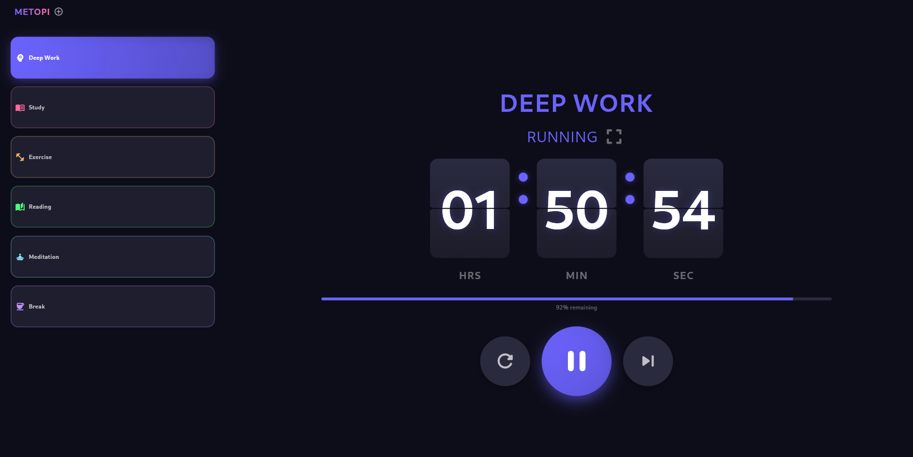
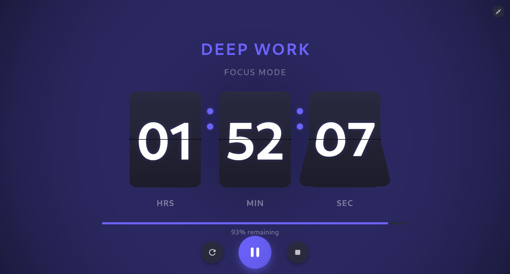

# metopi_timer

A lightweight, modular Flutter timer app that demonstrates animated timer widgets: a flip clock, flip-card timers, and a full-screen timer view. Suitable as a small productivity tool.

## Screenshots (placeholder)

## Contributing

Contributions welcome. Open issues or PRs with focused changes. Include screenshots for UI changes and tests for new logic.

## License

This project is licensed under the MIT License — see the [LICENSE](LICENSE) file for details.

